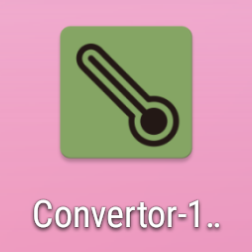
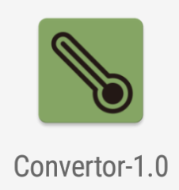
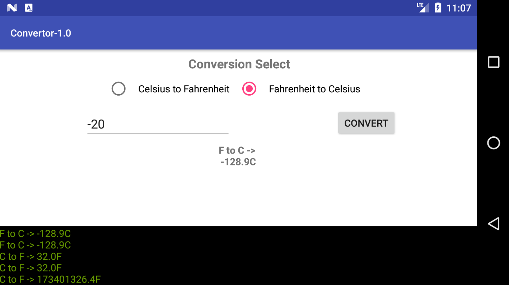

# Converter    V1.0
###### By Haomin Shi
## Read me
##### This app follows the "App Requirements" provide by the professor on BlackBoard.
1. The app allow the user to select either Fahrenheit to Celsius or Celsius to Farenheit converstions. And there is no other conversions allowed. By using the radio button, only one converstion is allowed.
2. The Constraint Layout is implemented.
3. In the doConverstion Function, two formulae provide by the professor for converstion is implemented.
4. The app is programmed to have the initial temperature value entered by the user.
5. After the converte button on the app, the doConversion function will be called, and then convert the value and display it on the screen.
6. The percision is set to have only one decimal digit.
7. In the app, at the botton, there is a plain text window to show user the history of previous converstions. The log history format follows the example provided in the Assignment1.pdf.
8. The app support landscape orientation.
9. The app contains no hard-coded strings, all the hint, text, and button string is in the Strings.xml file, and it support translation.

###### The app is developed using Android Studio -> Here is some of the Config for grading guidence
		applicationId "com.haomins.www.convertor_10"
        minSdkVersion 21
        targetSdkVersion 26
        versionCode 1
        versionName "1.0"
        testInstrumentationRunner "android.support.test.runner.AndroidJUnitRunner"

## App UI preview
##### App Logo:

  
  

##### Here is the app preview for Portrait Orientation:

   

##### Here is the app preview for Landscape Orientation:

  

## End
##### Assignment 1 for CS 442